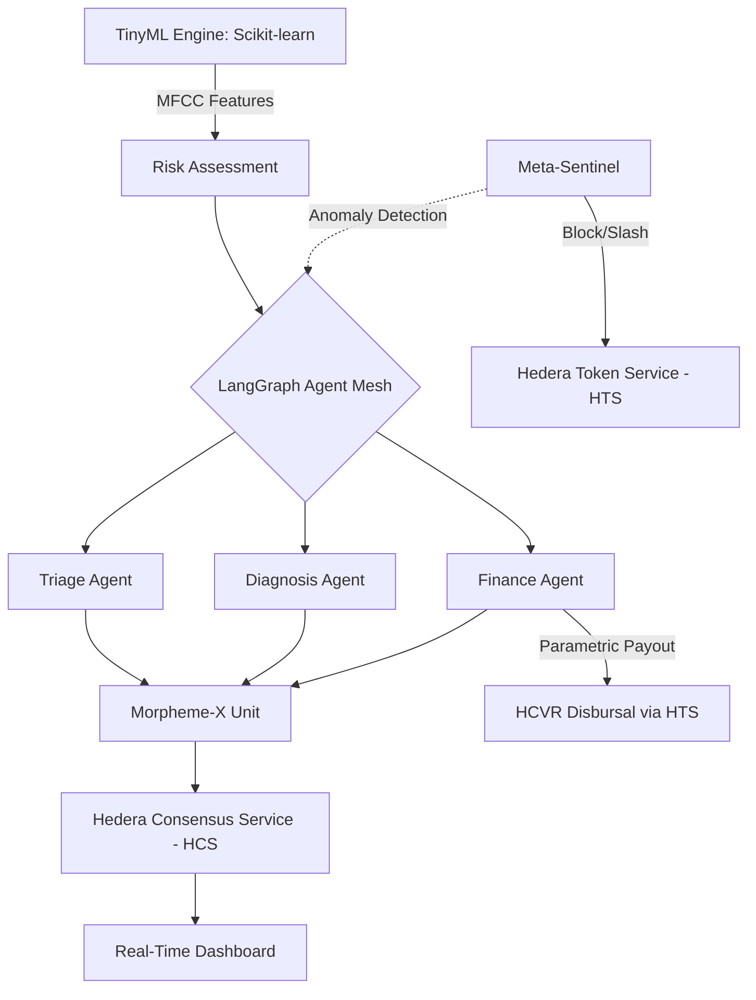

# AegisMorpheme-X (AMX) Protocol

> "AI decisions must be provable, enforceable, and economically accountable — or they don't execute."

[](LICENSE)


**Live Demo:** [aegis-morpheme-x.vercel.app](https://aegis-morpheme-x.vercel.app)  
**Backend API:** [aegis-morpheme-x.onrender.com](https://aegis-morpheme-x.onrender.com)

---

## 📽️ Judging Criteria Alignment

| Criteria | AMX Implementation |
|---|---|
| **Innovation** | Provable AI decisions via "Executable Morpheme-X" units sealed on Hedera HCS. Real-time anomaly detection slashing agent stakes via HTS. |
| **Presentation** | Institutional-grade dark dashboard with GSAP magnetic physics, real-time WebSockets, and a custom **interactive 3D Cobe globe**. |
| **Functionality** | End-to-end pipeline: **Real TinyML (Scikit-learn)** cough analysis → **LangGraph** agent mesh → **Hedera** settlement → **HCVR** parametric payouts. |
| **Problem Solving** | Solves the "Black Box AI" risk in critical infrastructure by ensuring every decision is verifiable, immutable, and bounded by economic penalties. |

---

## 🚀 Quick Start (Demo Mode)

**Prerequisites**
- Python 3.11+
- Node.js 20+
- No Hedera credentials needed to run in simulation mode (`SIMULATE_HCS=true`)

### 1. Clone & Configure
```bash
git clone https://github.com/tazwaryayyyy/Aegis-Morpheme-X.git
cd Aegis-Morpheme-X
cp .env.example .env
```
*Note: Ensure `SIMULATE_HCS=true` is set in `.env` to run without API keys.*

### 2. Start Backend
```bash
cd backend
python -m venv venv
venv\Scripts\activate
pip install -r requirements.txt
uvicorn main:app --reload --port 8000
```

### 3. Start Frontend
```bash
cd frontend
npm install
npm start
```
*Dashbord runs at `localhost:3000`. Wait for the ONLINE indicator to turn green.*

---

## 🧠 Core Technologies

### 1. Real TinyML Engine
The protocol uses a **Scikit-learn RandomForestClassifier** trained on synthetic MFCC (Mel-frequency cepstral coefficients) data. It analyzes 13 audio coefficients to predict cough risk, which then fuels the governance pipeline.

### 2. Executable Morpheme-X
AI decisions are sealed into cryptographic units and submitted to **Hedera Consensus Service (HCS)**. This creates an immutable audit trail of clinical and financial actions, accessible via **HashScan** with one click from the dashboard.

### 3. Meta-Sentinel (Economic Accountability)
A rolling 2-sigma anomaly detector monitors agent outputs. Deviations trigger:
1.  **HTS Slashing**: 10% of the agent's **AMXSTAKE** token balance is burned on-chain.
2.  **Auto-Retraining**: The anomaly is flagged as a "hard negative" for the next model iteration.

### 4. 3D Geo-Intelligence
An interactive **3D Cobe Globe** visualizes the One Health network, tracking real-time risk markers in Dhaka (Critical), Nairobi (Vector), and Singapore (Nominal).

---

## 🏗️ Architecture



---

## 📂 Project Structure

- **`backend/`**: FastAPI server with LangGraph agents and TinyML engine.
    - `agents/`: Clinical, financial, and sentinel agents.
    - `one_health/`: TinyML engine and environmental risk feeds.
    - `hedera/`: HCS and HTS SDK integrations.
- **`frontend/`**: React 18 dashboard.
    - `Dashboard.js`: Real-time state hub.
    - `ImpactDashboard.js`: Cumulative metrics aggregator.
    - `OneHealthMap.js`: Interactive 3D Globe (Cobe).
    - `App.tsx`: GSAP physics and layout.

---

## ⚡ 1-Minute Demo Path for Judges

1.  **Launch Dashboard**: Wait for the "ONLINE" status.
2.  **Select Scenario**: Click **[+] DHAKA_CRISIS** in the Scenario Switcher.
3.  **Watch the Stream**: Observe TinyML analysis → Sentinel Check → Morpheme Sealing.
4.  **Verify on Hedera**: Locate the newest Morpheme card and click **VERIFY ON HEDERA**. It will take you directly to HashScan to see the message sealed on HCS.
5.  **Check Impact**: Observe the **ANOMALIES_BLOCKED** count increase in the Impact Dashboard as the Meta-Sentinel catches rogue logic.

---

## 🔗 Author
**Tazwar Ahnaf**  
[GitHub](https://github.com/tazwaryayyyy) · [X](https://x.com/TazwarEnan)

