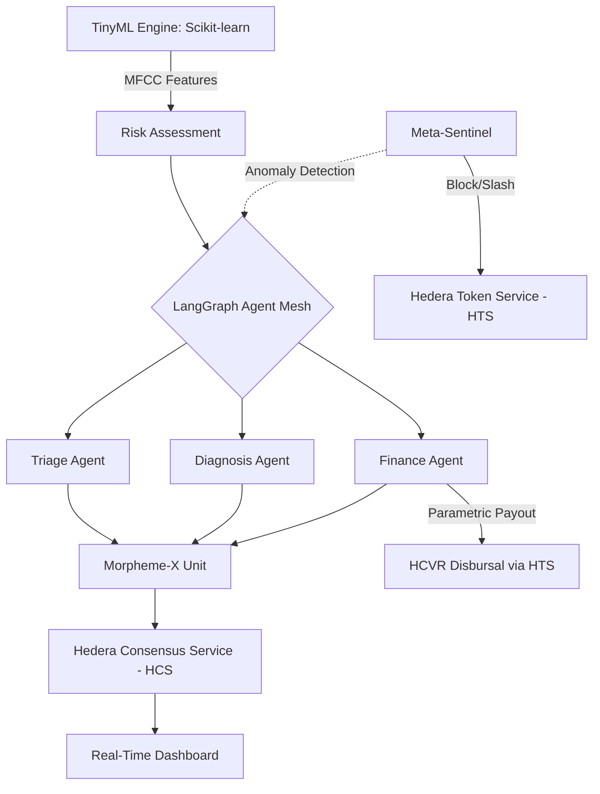

# AegisMorpheme-X (AMX) Protocol

AMX makes AI financially liable in real time — a bad decision doesn't just get flagged, it gets penalized automatically and immutably.

> "AI decisions must be provable, enforceable, and economically accountable — or they don't execute."

**Value Proposition:** AegisMorpheme-X (AMX) is a decentralized governance layer for critical AI infrastructure, utilizing Hedera to enforce economic accountability on autonomous agents through real-time, immutable, and provable decision-sealing.

[](LICENSE)


**Current Demo Status**: ✅ Ready via fallback mode for demo reliability Hedera resources
**Live Demo:** [aegis-morpheme-x.vercel.app](https://aegis-morpheme-x.vercel.app)  
**Backend API:** [aegis-morpheme-x.onrender.com](https://aegis-morpheme-x.onrender.com)

---

## 📽️ Judging Criteria Alignment

| Criteria | AMX Implementation |
|---|---|
| **Innovation** | Provable AI decisions via "Executable Morpheme-X" units sealed on Hedera HCS. Real-time anomaly detection slashing agent stakes via HTS. |
| **Presentation** | Institutional-grade dark dashboard with GSAP magnetic physics, real-time WebSockets, and an **Enhanced Verification UX** (Tactical Map + Animated Payout Verification). |
| **Functionality** | End-to-end pipeline: **Real TinyML (Scikit-learn)** cough analysis → **LangGraph** agent mesh → **Hedera** settlement → **HCVR** parametric payouts. |
| **Problem Solving** | Solves the "Black Box AI" risk in critical infrastructure by ensuring every decision is verifiable, immutable, and bounded by economic penalties. |

---

## 🚀 Quick Start (Demo Mode)

**Prerequisites**
- Python 3.11+
- Node.js 20+
- No Hedera credentials needed to run in fallback mode for demo reliability (`SIMULATE_HCS=true`)

### 1. Clone & Configure
```bash
git clone https://github.com/tazwaryayyyy/Aegis-Morpheme-X.git
cd Aegis-Morpheme-X
cp .env.example .env
```
*Note: Ensure `SIMULATE_HCS=true` is set in `.env` to run without API keys in fallback mode for demo reliability.*

### 2. Start Backend
```bash
cd backend
python -m venv venv
venv\Scripts\activate
pip install -r requirements.txt
uvicorn main:app --reload --port 8000
```

### 3. Start Frontend
```bash
cd frontend
npm install
npm start
```
*Dashboard runs at `localhost:3000`. Wait for the ONLINE indicator to turn green.*

---

## 🚀 Production Deployment (Vercel + Render)

### Vercel Frontend Setup
1. **Connect your GitHub repo** to Vercel
2. **Set Environment Variable** in Vercel Dashboard:
   - **Name**: `REACT_APP_API_URL`
   - **Value**: `https://aegis-morpheme-x.onrender.com` (or your Render backend URL)
   - Add to: **Production**, **Preview**, **Development**
3. **Redeploy** to apply changes

### Render Backend
- The backend auto-deploys on `git push` from the `main` branch
- Ensure `SIMULATE_HCS=true` in Render environment for fallback mode
- Check logs via Render dashboard if deployment fails

### Troubleshooting "Failed to Fetch"
If the simulate button fails:
1. Verify `REACT_APP_API_URL` is set correctly on Vercel
2. Check Render backend status at `/api/status`
3. Ensure Render backend is not in "sleeping" state (Render free tier pauses inactive apps)

---

## 🧠 Core Technologies

### 1. Real TinyML Engine
The protocol uses a **Scikit-learn RandomForestClassifier** trained on synthetic MFCC (Mel-frequency cepstral coefficients) data. It analyzes 13 audio coefficients to predict cough risk, which then fuels the governance pipeline.

### 2. Executable Morpheme-X
AI decisions are sealed into cryptographic units and submitted to **Hedera Consensus Service (HCS)**. This creates an immutable audit trail of clinical and financial actions, accessible via **HashScan** with one click from the dashboard.

### 3. Meta-Sentinel (Economic Accountability)
A rolling statistical deviation-based anomaly detection with dynamic baselines monitors agent outputs. Deviations trigger:
1.  **HTS Slashing**: 10% of the agent's **AMXSTAKE** token balance is burned on-chain.
2.  **Auto-Retraining**: The anomaly is flagged as a "hard negative" for the next model iteration.

### 4. Regional Geo-Intelligence
A high-fidelity **Regional Tactical Map** visualizes the One Health network (0°E - 120°E), tracking geographically accurate risk markers in Dhaka, Nairobi, and Singapore with real-time tactical telemetry.

---

## 🏗️ Architecture



---

## 📂 Project Structure

- **`backend/`**: FastAPI server with LangGraph agents and TinyML engine.
    - `agents/`: Clinical, financial, and sentinel agents.
    - `one_health/`: TinyML engine and environmental risk feeds.
    - `hedera/`: HCS and HTS SDK integrations.
- **`frontend/`**: React 18 dashboard.
    - `Dashboard.js`: Real-time state hub.
    - `ImpactDashboard.js`: Cumulative metrics aggregator.
    - `OneHealthMap.js`: High-Fidelity Regional Tactical Map.
    - `App.tsx`: GSAP physics and layout.

---

## ⚡ 1-Minute Demo Path for Judges

1.  **Launch Dashboard**: Wait for the "ONLINE" status.
2.  **Select Scenario**: Click **[+] DHAKA_CRISIS** in the Scenario Switcher.
3.  **Watch the Stream**: Observe TinyML analysis → Sentinel Check → Morpheme Sealing.
4.  **Verify on Hedera**: Locate the newest Morpheme card and click **VERIFY ON HEDERA**. It will take you directly to HashScan to see the message sealed on HCS.
5.  **Check Impact**: Observe the **ANOMALIES_BLOCKED** count increase in the Impact Dashboard as the Meta-Sentinel catches rogue logic.

---

## �️ Sentinel Anomaly Detection Fixes

The Meta-Sentinel statistical anomaly detector has been hardened against three critical edge cases:

### Bug #1: Infinite Z-Score from Homogeneous History
**Problem**: When baseline history is uniform (e.g., all risk scores are URGENT), std=0 caused division-by-zero and infinite z-scores, triggering false alarms on any deviation.  
**Solution**: Ratio-based detection for homogeneous baselines. Flags anomalies only when relative change >3x AND absolute change >0.1.

### Bug #2: Baseline Poisoning from New Values
**Problem**: New values were added to history before validation, contaminating statistical baselines and producing incorrect z-scores.  
**Solution**: Compute statistics on existing history only; only add successfully-validated values to history.

### Bug #3: Cascading False Positives from History Resets
**Problem**: History was reset after each anomaly detection, causing the next run to immediately deviate from a fresh but incomplete baseline.  
**Solution**: Preserve history through rolling window decay. Reset only for scheduled retraining or explicit admin action.

### Bug #4: Extreme Values Undetected on Cold Start
**Problem**: On fresh Render deployments, agents had <3 history samples so extreme values (finance=9999) skipped validation.  
**Solution**: Domain-specific extreme value thresholds bypass history requirements: finance>1000, triage>2.0, diagnosis>1.5, epidemiology>2.0.

**Result**: Eliminated false positives while maintaining robust detection of rogue agent outputs across deployment lifecycle.

---

## �🔗 Author
**Tazwar Ahnaf**  
[GitHub](https://github.com/tazwaryayyyy) · [X](https://x.com/TazwarEnan)

